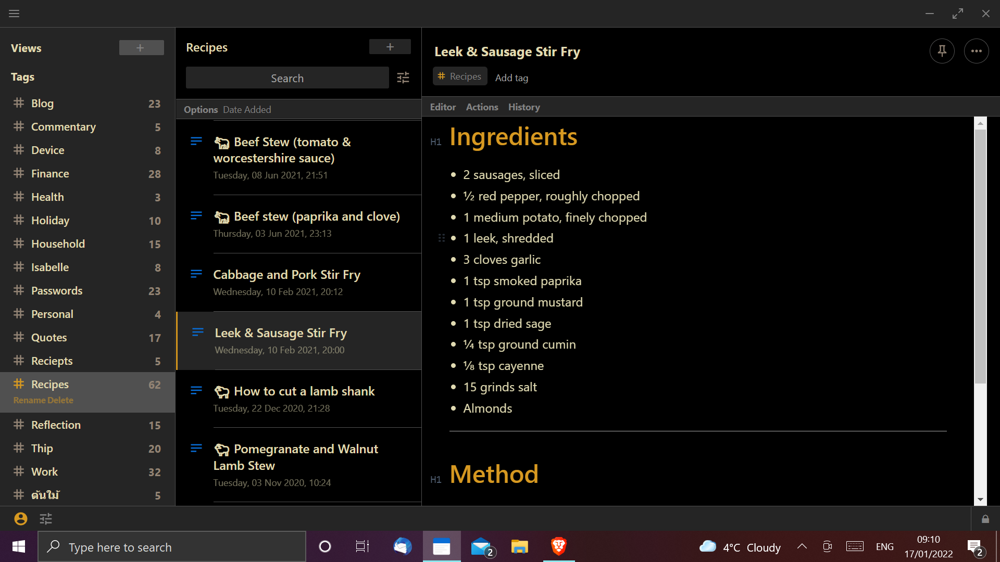

# Preview



# Installation

Open Preferences and to to General, Advanced Settings. Scroll to the bottom, paste the link below and Install.

https://listed.to/p/vclyVIoc6P

# Notes for creating your own theme

If you are struggling to create your own theme then try these steps.

1. Find an existing theme you like and install it on desktop.
2. Open up the standards notes data directory 
   1. Right click Standard Notes from Start Menu, go to More and click Open file location.
   2. Right click Standard Notes in the Explorer window that pops up and click Open file location.
   3. Now navigate up to AppData.
   4. Click into Roaming.
   5. Click into Standard Notes.
   6. Click into Extensions.
   7. Click into the theme you like.
   8. Click into dist.

9. Open dist.css and start tweaking it around. Each time you save changes, re-apply the theme in Standard Notes to see the effect.
3. Fork the repository of the same theme in Github to your personal account.
4. Rename the repository.
5. Click into dist folder and replace dist.css with your modified version.
6. Edit references to the repository name and version number (make a new version) in package.json and package-lock.json
7. Go over to releases in your repository and create a new release with the new version number.
8. Check out the Standard Notes documentation on [publishing extensions](https://docs.standardnotes.org/extensions/publishing).

   Your .json file should look something like this:
   ```
   ---
   metatype: json
   ---

     {
       "identifier": "your-domain-name.your-theme",
       "name": "Name of your theme",
       "content_type": "SN|Theme",
       "area": "themes",
       "description": "Short description of your theme.",
       "version": "v2.0.0",
    "url": "https://cdn.jsdelivr.net/gh/your-github-user-id/repository-name-of-your-theme@master/dist/dist.css",
    "download_url": "https://github.com/your-github-user-id/repository-name-of-your-theme/archive/2.0.0.zip",
    "marketing_url": "https://github.com/your-github-user-id/repository-name-of-your-theme",
    "latest_url": "Listed private link URL for this .json",
    "thumbnail_url": "https://raw.githubusercontent.com/your-github-user-id/repository-name-of-your-theme/master/screenshot-of-your-theme.png",
    "dock_icon": {
      "type": "circle",
      "background_color": "#D79921",
      "foreground_color": "#076678",
      "border_color": "#D79921"
    },
    "statusBar": "dark-content"
    }
   ```
